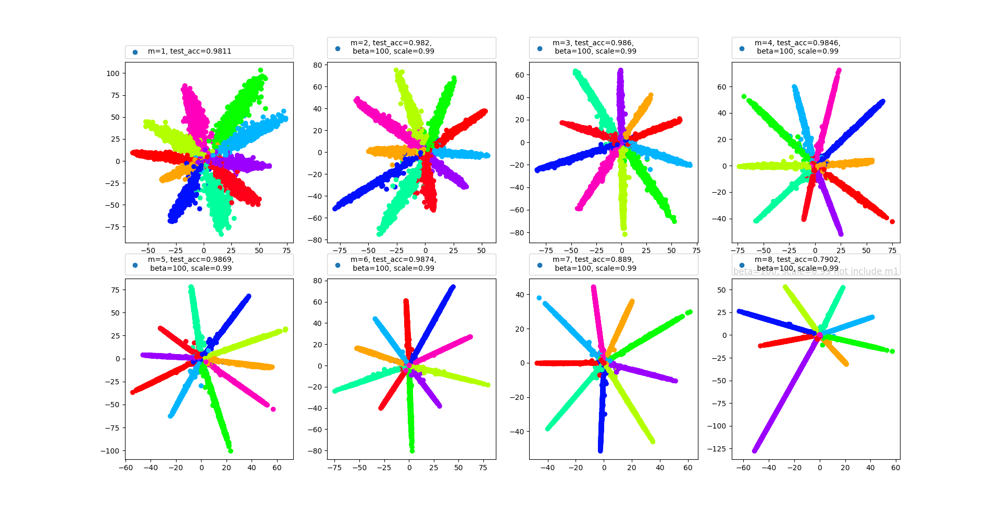

# L_Softmax_TensorFlow
TensorFlow version of L_SoftMax.
### Results:

I found `prelu` is quite stable than `relu`, so I used `prelu` as paper said.
### Reference:
* [mx-lsoftmax](https://github.com/luoyetx/mx-lsoftmax)
* [Large-Margin Softmax Loss for Convolutional Neural Networks](https://arxiv.org/pdf/1612.02295.pdf)
### Contribution
This is mainly implemented by `py_func`, which is quite slow. If anyone have implemented a `tf_op` in C++ or cuda, pull request is warmly welcome.